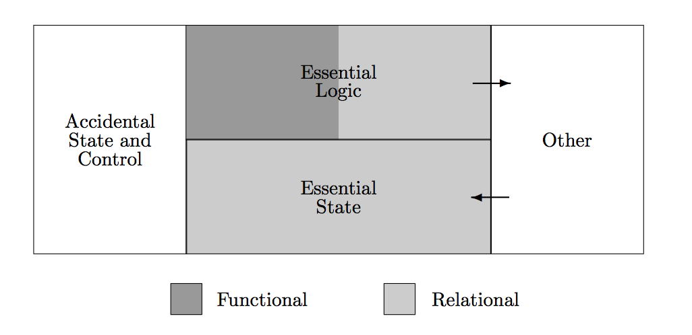

## Functional Relational Programming

### In UI Frameworks ###

_Jon Eisen_

LambdaConf

May 28, 2016

http://joneisen.me/r/frpui

-----


I'm from Boulder

-----

## Contents

- What is FRP?
- Examples in modern UI Frameworks

-----

## What is FRP?

**F**unctional **R**elational **P**rogramming was defined in _Out of the Tar Pit_ (2006 Marks and Moseley, pg 42).

> In FRP all essential state takes the form of relations, and the essential logic is expressed using relational algebra extended with (pure) user defined functions.

>>>>>

### What is FRP? ###



>>>>>

### What is FRP? ###

> The primary, overriding goal behind the FRP architecture is **elimination of complexity**.

>>>>>

#### What is FRP? ####

Data is modeled as a **Relational Model** using the **Relational Algebra**.

---

```
def relvar Room :: { address:address roomName:string
    width:double breadth:double type:roomType }

def relvar Offer :: { address:address offerPrice:price
    offerDate:date bidderName:name bidderAddress:address }
```

(All examples come from a real estate example in _Out of the Tar Pit_)

>>>>>

#### What is FRP?

Derived variables (views):
```
RoomInfo = extend(Room, (roomSize = width*breadth))

Offers = join(CurrentOffer,
    project(Property, address agent dateRegistered))
```

>>>>>

#### What is FRP? ####

Relational Constraints:

```
candidate key Room = (address, roomName)

foreign key Room (address) in Property

# Declarative data constraints
count(restrict(PropertyInfo | numberOfRooms < 1)) == 0
```

>>>>>

#### What is FRP?

Specifying Accidental Complexity:

```
# Hint to denormalize Room and Floor in storage
declare store shared Room Floor

# Hint to store large blobs separately
declare store separate Property (photo)
```

>>>>>

#### What is FRP?

Declarative statement of _effects_:

- **Feeders**: Modify the underlying state on input (subject to constraints).
- **Observers**: Listeners on a relation that show export data or update UI

(These notions are very underdeveloped in the paper)

>>>>>

#### What is FRP?


zzz...

-----

### What is FRP?
#### TL;DR

- Relational model specifies essential state
- Relational algebra specifies essential logic
- Observers listen on a relation to update UI and outputs
- Accidental complexity can be specified declaratively

>>>>>

### What is the ESSENCE of FRP?

- Separation of _data state_ from UI and external actions
- Separation of _essential_ and _accidential_ complexity
- Relational data model: _composable_ and _powerful_
- Observers are **pure** functions of data
- _Declarative_ data constraints

-----

### UI Design Influences

I believe modern UI frameworks partially implement the ideas of Functional Relational Programming.

-----

### Examples in Web UI

- Elm
- Redux
- Om

-----

## Timeline Note

- Feb 3, 2006: `jQuery.com` published
- Feb 6, 2006: _Out of the Tar Pit_ published
- 2007 - today: Everyone forgets OotTP

-----

#### Elm Architecture

- Model: the state of your application
- Update: a pure reducer of state
- View: functions of state that render HTML

>>>>>

#### Elm Architecture

```elm
type alias Model = { ... }
```

``` elm
-- UPDATE
type Msg = Reset | ...

update : Msg -> Model -> Model
update msg model =
  case msg of
    Reset -> ...
    ...

```

``` elm
-- VIEW
view : Model -> Html Msg
view model =
  ...
```

>>>>>

#### Elm

- Separation of _data_ from _UI_ (**Observers**)
- Separation of _actions_ from _data_ (**Feeders**)
- Pure data reductions and react UI.

But...

- No subscriptions
- Logic and State are not relational
- Logic is mixed with Observers

>>>>>


Intriguing...

-----


#### Redux

Based on _Flux Architecture_:


And based on Elm.

>>>>>

#### Redux

```javascript
let store = createStore(update) //update: state -> action -> state

// Observer!
store.subscribe(() =>
  console.log(store.getState())
)

// Feeder!
store.dispatch(action)

// Pure state reducer!
function stateReducer(state, action) { return newState }
```

```javascript
// React Component
class Counter extends Component {
  render() {
    return (<div><span>{this.props.value}</span></div>)
  }
}
```

>>>>>

#### Redux
##### Like FRP?

Much like Elm...

- Separation of _data_ from _UI_ (**Observers**)
- Separation of _actions_ from _data_ (**Feeders**)
- Pure data reductions and react UI.
- _Essential logic_ is separated into action handlers and subscriptions

But...

- No way to filter subscriptions
- Logic and State are not relational

>>>>>


More Intriguing...

-----

#### Om ####

```clj
;; Read from the data
(defmulti read om/dispatch)

;; Mutate the data
(defmulti mutate om/dispatch)

```

```clojure
(defui Counter
  static om/IQuery
  (query [this] [{:cntr [:app/counter]}]))

```


``` clojure
(defui CounterReact
  static om/IQuery (om/get-query Counter)
  Object (render [this]
           (let [{count :app/counter :as entity}
                 (get-in (om/props this) [:cntr 0])]

      ;; UI
      (dom/div
        (dom/span nil (str "Count: " count))
        (dom/button
          #js {:onClick
               #(om/transact! this [[:app/increment entity]])}
          "Click me!")))))

```


>>>>>

#### Om/Datascript

```clojure
(require '[datascript.core :as d])

(def conn (d/create-conn {}))

(d/transact! conn [{:app/id :the-one-counter
                    :app/count 0}])
```

```clojure
(defmethod read :app/counter
  [{:keys [state query]} _ _]
  {:value (d/q `[:find [(pull ?e ?selector) ...]
                 :in $ ?selector
                 :where [?e :app/id]]
            (d/db state) query)})

(defmethod mutate :app/increment
  [{:keys [state]} _ entity]
  {:value {:keys [:app/counter]}
   :action (fn [] (d/transact! state
                    [(update-in entity [:app/count] inc)]))})
```

>>>>>

#### Om Next

Newest form of Om.

Provides infrastructure for synchronizing data to server

(The **Accidental Complexity** of UI Programming)

>>>>>

#### Om

Just like Elm and Redux:

- Separation of _data_ from _UI_ (**Observers**)
- Separation of _actions_ from _data_ (**Feeders**)
- Pure data reductions and react UI.
- _Declarative_ datalog queries for observers! (Essential Logic)

Om Next can even take care of accidental complexity

>>>>>


Cool!

-----

## BONUS

### Fyra

A side project of mine that implements Codd's Relational Model.

>>>>>

#### Fyra

Plugged in to Om:

``` clojure
(defrelvar Room :address :room-name :width :breadth :type)
(defview RoomInfo (extend Room :room-size (* width breadth)))
(defview LargeRoomInfo (restrict RoomInfo (> 500 room-size)))

(insert db Room room-map) ; also update/delete
```

``` clojure
(defui LargeRooms
  static om/IQuery
  (query [this] {:rooms LargeRoomInfo})
  Object (render [this]
    (dom/ul
      (for [room (:rooms (om/props this))]
        (dom/li (:room-name room))))))
```

>>>>>

#### Fyra

All the beauty of Om's framework with Codd's relational model.

http://joneisen.me/r/fyra

**Warning**: Active development.

>>>>>


So you did do some work for this talk...

-----

## Recap

- The ideas of FRP were not popular when published
- FRP is partially implemented in today's UI frameworks
- UI Frameworks have improved other areas that FRP didn't flesh out

>>>>>

## Conclusions

Although FRP was forgotten, software seems to have moved in its direction.

Perhaps this means it was a good idea?

>>>>>

### Does FRP solve the _Software Crisis_?


Probably Not.

-----

## Thanks

_Jon Eisen_

[@jm_eisen](http://twitter.com/jm_eisen)

http://joneisen.me

Enjoy LambdaConf!
