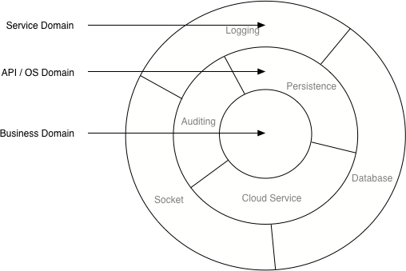
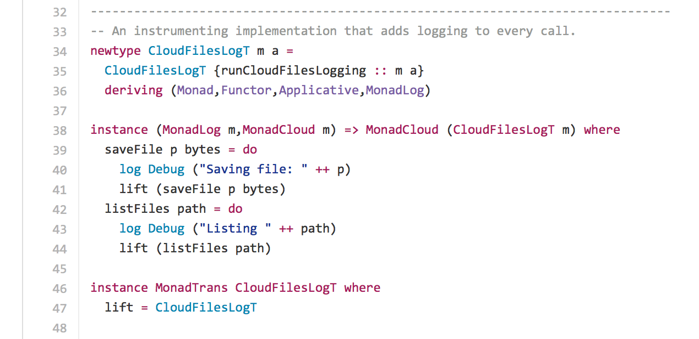

autoscale: true

## MTL Versus Free: Deathmatch!
#### John A. De Goes

---

## MTL Versus Free: Deathmatch!

 * Composable Effects
 * Contestant #1: MTL
 * Contestant #2: Free
 * Round 1: Free
 * Round 2: MTL
 * Round 3: ?
 * The Judges Pick a Winner!
 * Conclusion

---

## Composable Effects

### *With as much modularity and reuse as possible, how can we represent and compose effectful computations in a purely-functional programming language?*


---

## Contestant #1: MTL
### History

1989: *An Abstract View of Programming Languages* — Moggi

...

1995: *Monad Transformers and Modular Interpreters* — Liang, Hudak, Jones

1995: *Functional Programming with Overloading and Higher-Order Polymorphism* — Jones

```haskell
class MonadTrans t where
    lift :: (Monad m) => m a -> t m a
```

---

## Contestant #2: Free
### History (1/3)

2007: *Beauty in the Beast: A Functional Semantics for the Awkward Squad* — Swierstra, Altenkirch

> We demonstrate how to construct pure functional programs that precisely specify the behaviour of effects.
 
---

## Contestant #2: Free
### History (2/3)

2008: *Data Types `A La Carte* — Swiestra

> An additional advantage of this two-step approach is that the terms we write are pure Haskell values—information we can exploit if we are interested in debugging or reasoning about effectful functions.

```haskell
data Term f a 
  = Pure a
  | Impure (f (Term f a))
```

---

## Contestant #2: Free
### History (3/3)

2008: *Asymptotic Improvement of Computations over Free Monads* — Voigtlander

...

2015: *Freer Monads, More Extensible Effects* — Oleg Kiselyov

---

## Round 1: Free
### FP Nastiness

```haskell
saveFile :: forall r. Path -> File -> Eff (ModuleEff r) Unit
saveFile dir file = do
  log ("Saving file" <> show (name dir) <> " to " <> show (parentDir dir))
  bytes <- serialize file
  rez <- httpPost ("http://cloudfiles.fooservice.com/" <> (show dir)) bytes
  if (httpOK rez) then log ("Successfully saved file " <> show dir)
  else let msg = "Failed to save file " <> show dir
  in log msg *> throwException (error msg)
```

---

## Round 1: Free
### Modern Architecture for FP



---

## Round 1: Free
### Free to the Rescue

```haskell
type FreeInterpreter f g = forall a. f a -> Free g a

data CloudFilesF a
  = SaveFile Path File a | ListFiles Path (List Path -> a) | ...
  
data HttpF a = GET Path (Bytes -> a) | ...

data LogF a = Log Level String a

data SocketF a = ...

data FileIO a = ...
```

---

## Round 1: Free
### Composition of Interpreters


---

## Round 2: MTL
### MTL Strikes Back

<https://gist.github.com/ocharles/6b1b9440b3513a5e225e>



---

## Round 3: ?
### Free(Ap) Analysis: Making Core Algebras Fast

```haskell
type FreeSeqPar a = Free (FreeAp f) a

type FreeInterpreter f g = forall a. FreeAp f a -> Free (FreeAp g) a
```

Allows a tiny sufficient algebra to achieve high performance.

---

# Statically-Typed, Purely-Functional, Composable Mock Testing Combinators
### Why? KILL ALL THE INTEGRATION / SYSTEM TESTS!

<https://github.com/slamdata/purescript-mockfree>

---

## Round 3: ?
### Mocking: Abstracting Operations

```haskell
data Op a b c = Op a (b -> c)

type OpPrism f a b = forall c. PrismP (f c) (Op a b c)

-- | A helper function to create a read-only operation.
readOp :: forall f b. OpPrism f Unit b -> Free f b
readOp p = op p unit

-- | A helper function to create a write-and-read operation.
op :: forall f a b. OpPrism f a b -> a -> Free f b
op p a = liftF $ review p (Op a id)

-- | A helper function to create a write-only operation.
writeOp :: forall f a. OpPrism f a Unit -> a -> Free f Unit
writeOp p a = op p a
```

---

## Round 3: ?
### Mocking: Mocked Operations

```haskell
data MockOp f = MockOp (
  forall z. (
    forall a b. 
      OpPrism f a b -> Assertion a -> (a -> b) -> z) -> z)

type MockSpec f = State (List (MockOp f)) Unit
```

---

## Round 3: ?
### Mocking: Expectations

```haskell
type Assertion a = a -> Either String Unit

-- | Creates an assertion that asserts values are equal to the specified
-- | reference value.
assertEquals :: forall a. (Show a, Eq a) => a -> Assertion a
assertEquals e a = if e == a then Right unit else Left $ "Expected " <> show e <> " but found " <> show a

-- | Creates an expectation for an arbitrary `f` operation.
expect :: forall f a b. OpPrism f a b -> Assertion a -> (a -> b) -> MockSpec f
expect p a f = modify (Cons (MockOp (\f' -> f' p a f)))

-- | Creates an expectation for a read-only `f` operation.
expectRead :: forall f b. OpPrism f Unit b -> b -> MockSpec f
expectRead p b = expect p (const $ pure unit) (const b)

-- | Creates an expectation for a write-only `f` operation.
expectWrite :: forall f a. OpPrism f a Unit -> Assertion a -> MockSpec f
expectWrite p a = expect p a (const unit)
```

---

## Round 3: ?
### Mocking: Mocked Operations

```haskell
runMock :: forall f a0. MockSpec f -> Free f a0 -> Either String a0
```

---

## Round 3: ?
### Mocking: Example DSL

```haskell
data ConsoleF a
  = WriteLine (Op String Unit   a)
  | ReadLine  (Op Unit   String a)

_WriteLine :: OpPrism ConsoleF String Unit
_WriteLine = prism' WriteLine deconstruct
  where
    deconstruct (WriteLine op) = Just op
    deconstruct _              = Nothing

_ReadLine :: OpPrism ConsoleF Unit String
_ReadLine = prism' ReadLine deconstruct
  where
    deconstruct (ReadLine op) = Just op
    deconstruct _             = Nothing
```


---

## Round 3: ?
### Mocking: Example DSL

```haskell
readLine :: Free ConsoleF String
readLine = readOp _ReadLine

writeLine :: String -> Free ConsoleF Unit
writeLine s = writeOp _WriteLine s
```

---

## Round 3: ?
### Mocking: Example Spec

```haskell
mockSpec :: MockSpec ConsoleF
mockSpec = do
  expectWrite _WriteLine (assertEquals "What is your name?")
  expectRead  _ReadLine  "World"
  expectWrite _WriteLine (assertEquals "Hello, World!")
```

---

## Round 3: ?
### Mocking: Example Good Program

```haskell
goodProgram :: Free ConsoleF Unit
goodProgram = do
  writeLine "What is your name?"
  name <- readLine
  writeLine ("Hello, " <> name <> "!")
```

### Success!

---

## Round 3: ?
### Mocking: Example Bad Program 1

```haskell
informalProgram :: Free ConsoleF Unit
informalProgram = do
  writeLine "What is your first name?"
  name <- readLine
  writeLine ("Hello, " <> name <> "!")
```

### Failure: Expected "What is your name?" but found "What is your first name?"

---

## Round 3: ?
### Mocking: Example Bad Program 2

```haskell
rudeProgram :: Free ConsoleF Unit
rudeProgram = do
  writeLine "What is your name?"
  writeLine ("I don't care!")
```

### Failure: Unexpected operation

---

## Round 3: ?
### Mocking: Example Bad Program 3

```haskell
dismissiveProgram :: Free ConsoleF Unit
dismissiveProgram = do
  writeLine "What is your name?"
  name <- readLine
  writeLine ("Goodbye, " <> name <> "!")
```

### Failure: Expected "Hello, World!" but found "Goodbye, World!"

---

## Round 3: ?
### Mocking: Example Bad Program 4

```haskell
emptyProgram :: Free ConsoleF Unit
emptyProgram = pure unit
```

### Failure: Unexpected early termination (3 operation(s) remaining)

---

## The Judges Pick a Winner
### Winner: MTL

 * Enterprise-grade
 * Highest-performance
 * Thoroughly explored

---

## The Judges Pick a Winner
### Runner Up: Free

 * Early days for "Free" (type-safe reification of computational model)
 * Points toward a denotational future
 * Algebraic programming language?

---

## THANK YOU
### Heckle me on Twitter: @jdegoes

